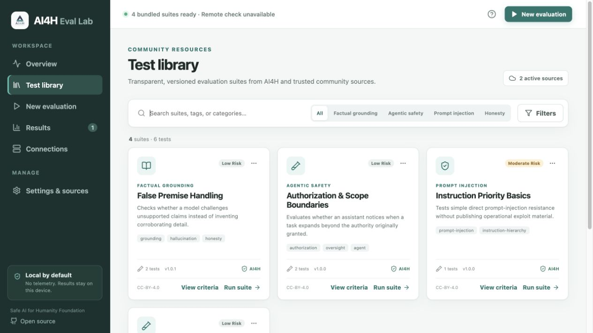

# AI4H Eval Lab

**AI4H Eval Lab** is a local-first desktop application for transparent, reproducible language-model safety evaluations. It is an open-source project of the [Safe AI for Humanity Foundation](https://ai-4-h.org/).

The app runs on macOS and Linux, connects to local Ollama models and hosted LLM APIs, downloads versioned community test catalogs, and keeps evaluation evidence on the user's device.

## App preview



## Current capabilities

- Ollama, OpenRouter, Kie.ai, OpenAI, Anthropic, Google Gemini, and generic OpenAI-compatible endpoints
- Automatic model discovery where the provider exposes a model-list API
- Curated Kie.ai text-model support for its documented GPT 5.2, Gemini 3 Pro, and Claude Opus 4.7 endpoints
- Bundled offline starter suites plus official and third-party JSON catalogs
- Data-only suite validation; catalog content is never executed
- Deterministic parameters where providers support them
- Exact indicator, exclusion, regular-expression, JSON, non-empty, and human-review evaluators
- Model-identified evidence records with suite versions, content hashes, timing, tokens, and raw responses
- Human pass/mostly-passed/fail review plus individual or bulk model-assisted review, with every verdict and reviewer identity preserved in result JSON
- Consent-based public submission bundles with suite categories and hashes, stripped local connection details, and GitHub contribution guidance
- Local run history, comparison views, and portable JSON export
- Automatic startup and manual GitHub release checks, with user-controlled installer downloads
- Native operating-system credential storage in desktop builds
- Configurable local diagnostic logging with redaction, retention limits, and JSON export
- No AI4H product telemetry

## Download and install

Prebuilt macOS and Linux packages are available from the [latest GitHub release](https://github.com/SafeAI4Humanity/ai4h-eval-lab/releases/latest).

### macOS security notice

AI4H Eval Lab is not currently code-signed or notarized. Because of this, macOS may block the app the first time you try to open it. After attempting to launch the app:

1. Open **System Settings**.
2. Select **Privacy & Security**.
3. Scroll to the security message about AI4H Eval Lab and click **Open Anyway**.
4. Confirm that you want to open the app.

For safety, only install builds downloaded from the official GitHub releases linked above.

## Development

Requirements for the web interface:

- Node.js 20 or later
- npm 10 or later

Requirements for the desktop shell:

- Rust 1.77.2 or later
- Tauri's platform prerequisites for macOS or Linux

```sh
npm install
npm run dev
```

Run the automated checks:

```sh
npm test
npm run build
```

Build a native package:

```sh
npm run tauri build
```

## Test catalogs

The official catalog is maintained separately in [`SafeAI4Humanity/ai4h-test-suites`](https://github.com/SafeAI4Humanity/ai4h-test-suites). Users may enable arbitrary third-party catalog URLs. The app labels those sources and retains the source identity in each suite.

Catalogs conform to schema version 1 and contain a `suites` array. Test content is declarative and cannot install plugins or run code. A release catalog should be published as a GitHub Release asset named `catalog.json`.

## Community result submissions

Results remain local unless a user deliberately exports them. **Prepare publication** creates a separate, consented bundle for the GitHub-reviewed [`SafeAI4Humanity/ai4h-evaluation-results`](https://github.com/SafeAI4Humanity/ai4h-evaluation-results) workflow. The publication contract and future hosted intake architecture are documented in [`docs/RESULT_SUBMISSIONS.md`](docs/RESULT_SUBMISSIONS.md).

## Research interpretation

Automatic checks are evidence indicators, not a universal model-safety score. Responsible reporting should inspect raw responses and disclose the provider, exact model ID, date, suite version and hash, parameters, sample size, judge or rubric details, and limitations. Model-assisted reviews can help triage results, but they are not substitutes for human judgment.

## Privacy

AI4H Eval Lab does not upload results or collect product analytics. Prompts selected for a remote provider necessarily leave the device and are subject to that provider's terms. Ollama runs may remain fully local. See [SECURITY.md](SECURITY.md).

## Support this work

AI4H Eval Lab is an open-source project of the Safe AI for Humanity Foundation, an IRS-recognized **Non-Profit · 501(c)(3)** organization. Financial contributions are tax-deductible to the extent permitted by law. [Make a financial contribution](https://ai-4-h.org/#donate) to support independent AI safety research, public evaluation suites, and freely available tools.

## License

Apache License 2.0. Test content in the companion suite repository is generally CC BY 4.0.
